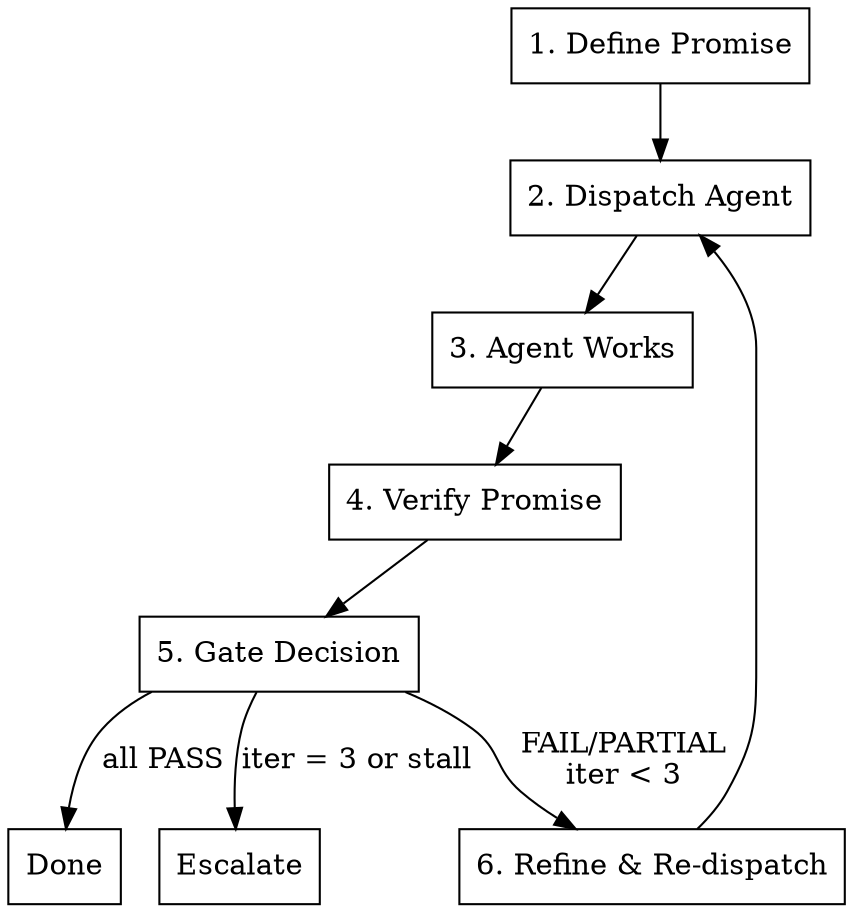

# Completion Promise Loop

## Overview

Define "done" before starting. Iterate toward it. Hard-stop if stuck.

**Core principle:** Every dispatch begins with a promise — a checklist of verifiable outcomes. The loop runs until the promise is fulfilled or the iteration cap is hit.

**Announce at start:** "I'm using the completion-promise-loop skill to converge on [goal]."

## When to Use

- Target is verifiable (command exits 0, assertion passes, pattern absent from codebase)
- Agent may need multiple passes to get there
- Success is binary or checklistable — not subjective

**Examples:** "optimize until under 50ms", "refactor all files to new pattern", "fix all lint errors in module X", "migrate all usages of deprecated API"

## When NOT to Use

- **Exploratory work** — no clear "done" exists yet (brainstorm first)
- **Single-shot tasks** — one dispatch will obviously suffice
- **PR readiness** — use `pr-completion-loop` (domain-specific gates)
- **Spec compliance** — use `subagent-driven-development` (review loops)
- **Subjective quality** — "make the code cleaner" is not a promise

## The Promise

Define upfront what "done" looks like as a checklist of verifiable outcomes. Each item must be testable — a command, assertion, or grep. Not subjective.

```
Promise:
- [ ] All files in src/auth/ use new AuthProvider pattern
- [ ] No remaining imports from deprecated auth module
- [ ] Tests pass: npm test -- --testPathPattern=auth
```

**Rules:**
- Write the promise BEFORE dispatching anything
- Every item must have a verification command or check
- If you can't write a verification check, the item is too vague — rewrite it

**Anti-patterns:**
- "Code is clean" — unverifiable
- "Performance is good" — needs a number: "p95 latency < 50ms"
- "All edge cases handled" — needs specific cases listed

## State Tracking

Maintain this table across iterations. Print it after each verify step.

```
| Promise Item           | Iter 1              | Iter 2        | Iter 3 |
|------------------------|---------------------|---------------|--------|
| AuthProvider pattern   | PARTIAL (3/7 files) | PARTIAL (6/7) | PASS   |
| No deprecated imports  | FAIL                | PASS          | PASS   |
| Tests pass             | FAIL                | FAIL          | PASS   |
```

**Status values:** `PASS` / `FAIL` / `PARTIAL:<detail>` / `—` (not yet checked)

## The Loop



### Step 1: Define Promise

Write the checklist before dispatching anything. Each item needs:
- What to check
- How to verify (command, grep, assertion)
- What PASS looks like

### Step 2: Dispatch Agent

Use the Task tool. Include in the prompt:
- Full context for the task
- Promise items as explicit acceptance criteria
- Verification commands the agent should run before reporting back
- Model tier (see Model Tiering below)

### Step 3: Agent Works

Agent executes the task and returns a report. The report should include:
- What it changed
- Which promise items it believes are satisfied
- Any issues encountered

### Step 4: Verify Promise

**Independently check every promise item.** Do not trust the agent's self-report.

For each item, run the verification command yourself and record the result in the state table.

### Step 5: Gate Decision

```
IF all items PASS:
  → Done. Print final state table + evidence.

IF any FAIL/PARTIAL AND iteration < 3 AND not stalled:
  → Go to Step 6.

IF iteration = 3:
  → Escalate.

IF state table identical to previous iteration:
  → Stall detected. Escalate immediately.
```

### Step 6: Refine & Re-dispatch

Build a new prompt for the next agent. Include:
- What passed (DO NOT redo these)
- What failed, with details from verification
- What the previous agent reported
- Specific instructions for remaining items

See Refinement Prompt Template below.

## Model Tiering

Reference `dispatching-parallel-agents` for full tiering rationale.

| Attempt | Default Model | When to Change |
|---------|---------------|----------------|
| 1st     | sonnet        | Standard starting point |
| 2nd     | sonnet        | Refine the prompt first, not the model |
| 3rd     | opus          | Promote if task requires deeper reasoning |
| Verify-only | haiku     | Just checking results, not fixing |

**Rule:** Try refining the prompt before promoting the model. A better prompt on sonnet often beats a vague prompt on opus.

## Refinement Prompt Template

Use this structure for iteration 2+ dispatches:

```
You are continuing work on a task. Previous attempt made partial progress.

## What's Done (DO NOT redo)
[items that PASS — list them with evidence]

## What Still Needs Work
[items that FAIL/PARTIAL — include verification output showing what's wrong]

## Previous Agent's Report
[summary of what they tried and what they said]

## Your Job
Fix the remaining items only. Specifically:
- [item 1]: [specific instruction based on what failed]
- [item 2]: [specific instruction based on what failed]

Verify each fix before reporting back:
- [verification command 1]
- [verification command 2]
```

## Common Mistakes

**Re-dispatching the entire task**
- Problem: Agent redoes work that already passed, potentially breaking it
- Fix: Refinement prompt explicitly lists what's done and says DO NOT redo

**Vague promises**
- Problem: "Code is better" — loop never converges because you can't verify it
- Fix: Every promise item needs a verification command. No command = rewrite the item.

**Trusting agent self-report**
- Problem: Agent says "all done" but 2 items still fail
- Fix: Always verify independently. Per `verification-before-completion`: evidence before claims.

**No hard cap**
- Problem: Loop runs forever burning tokens
- Fix: Max 3 iterations. Non-negotiable.

**Promoting to opus too early**
- Problem: First attempt fails, immediately jump to opus
- Fix: Refine the prompt first. Bad prompts fail on any model. Promote only on iteration 3.

**Not passing context to next iteration**
- Problem: New agent repeats same mistakes because it doesn't know what was tried
- Fix: Refinement prompt includes previous agent's report and specific failure details.

## Exit Conditions

### Done

All promise items PASS. Print:
- Final state table with all items showing PASS
- Evidence for each (command output, grep results)
- Number of iterations used

### Escalate

Report to user when:
- 3 iterations exhausted with items still failing
- **Stall detected:** State table identical between two consecutive iterations — agent can't make progress. Escalate immediately, don't burn the next iteration on the same failure.
- Unrecoverable failure (agent reports it cannot complete the task)

Escalation output:
- State table showing what passed and what didn't
- Summary of what each iteration attempted
- Recommendation for what to try next (different approach, manual intervention, scope reduction)

## Integration

| Relationship | Skill | How |
|-------------|-------|-----|
| Complements | `dispatching-parallel-agents` | Add convergence to individual parallel tasks |
| Complements | `subagent-driven-development` | Use for implementation loops within each task |
| Delegates to | `verification-before-completion` | Verify step uses its evidence-before-claims principle |
| References | `dispatching-parallel-agents` | Model tiering guidance |

## Quick Reference

| Parameter | Value |
|-----------|-------|
| Max iterations | 3 |
| Model default | sonnet |
| Promise required | Yes, before first dispatch |
| Trust agent self-report | Never |
| Stall detection | Yes — identical state = escalate immediately |
| Verify step | Independent, run commands yourself |
| Refinement prompt | Must include what passed, what failed, previous report |
