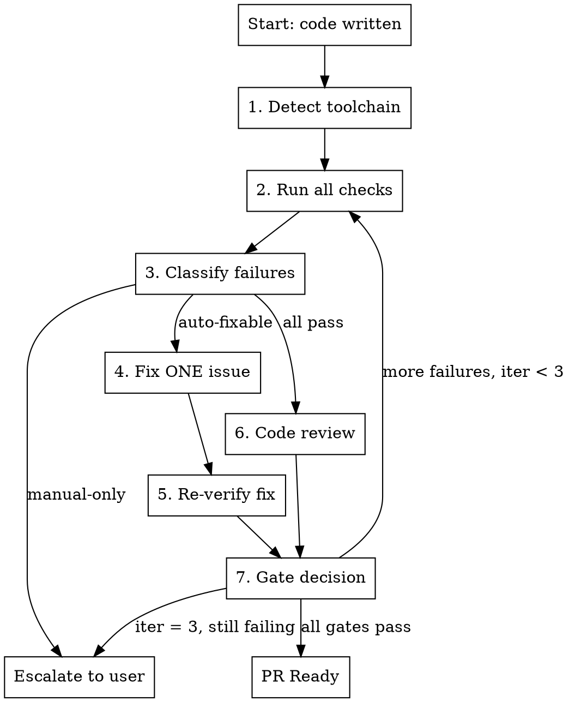

# PR Completion Loop

## Overview

Orchestrate the full cycle from "code written" to "PR ready" through structured check-fix-review-verify iterations.

**Core principle:** One fix, one verify. Converge, don't thrash.

**Announce at start:** "I'm using the pr-completion-loop skill to get this PR ready."

## When to Use

- Implementation complete, need to ship a clean PR
- Multiple check types required (tests, lint, types, build)
- Want structured evidence that everything passes before PR creation

## When NOT to Use

- Quick single-file fix (just run tests and commit)
- Exploratory work not headed for a PR
- Draft PR for early feedback (just push and open draft)

## Required Skills

This skill orchestrates — it delegates to:

| Skill | Role in Loop |
|-------|-------------|
| `verification-before-completion` | Gate function: evidence before claims |
| `requesting-code-review` | Dispatch code reviewer after checks pass |
| `receiving-code-review` | Process review feedback with technical rigor |
| `commit` | Commit fixes with conventional commits |
| `finishing-a-development-branch` | Handoff after loop declares ready |

## State Tracking

Maintain this table across iterations. Print it after each step.

```
| Gate              | Iter 1 | Iter 2 | Iter 3 |
|-------------------|--------|--------|--------|
| Tests             |        |        |        |
| Lint              |        |        |        |
| Types/Build       |        |        |        |
| Env/Secrets       |        |        |        |
| Code Review       |        |        |        |
| Review Fixes      |        |        |        |

Status: PASS / FAIL:<reason> / SKIP:<reason> / —
```

## The Loop



### Step 1: Detect Toolchain

Infer from project files. Don't ask the user what to run.

| File | Toolchain | Check Command |
|------|-----------|---------------|
| `package.json` | Node/TS | `npm test`, `npm run lint`, `npm run build` |
| `Cargo.toml` | Rust | `cargo test`, `cargo clippy`, `cargo build` |
| `pyproject.toml` / `requirements.txt` | Python | `pytest`, `ruff check .`, `mypy .` |
| `go.mod` | Go | `go test ./...`, `golangci-lint run`, `go build ./...` |
| `biome.json` | Biome | `npx biome check .` |
| `Makefile` | Make | Check for `lint`, `test`, `build` targets |

Run what exists. Skip what doesn't. Note skips in state table.

### Step 2: Run All Checks

Run every detected check. Capture full output. Record pass/fail in state table.

**Order:** Tests → Lint → Types/Build → Env/Secrets

For env/secrets: `git diff --cached --name-only | grep -E '\.env|secret|credential'`

### Step 3: Classify Failures

| Category | Auto-fix? | Examples |
|----------|-----------|---------|
| Lint/format | YES | Missing semicolons, import order, trailing whitespace |
| Type errors | YES | Missing types, wrong return type, unused imports |
| Test failures | NO | Always manual — too risky to auto-fix |
| Security issues | NO | Exposed secrets, vulnerable deps, auth bypasses |
| Build errors | MAYBE | Missing exports yes, logic errors no |

**If ALL pass:** Skip to Step 6 (code review).

**If only manual-fix failures:** Escalate to user immediately. Don't loop.

### Step 4: Fix ONE Issue

Pick the simplest auto-fixable failure. Fix it. Commit it.

**Rules:**
- ONE fix per iteration. Isolates regressions.
- Use `commit` skill with conventional commit format.
- Never batch auto-fixes — if fix A breaks something, you need to know.

### Step 5: Re-verify the Fix

Re-run the specific check that failed. Confirm it passes now.

**Then re-run ALL checks** — the fix might have caused a regression elsewhere.

Update state table.

### Step 6: Code Review

When all automated checks pass, dispatch code review via `requesting-code-review` skill.

Process feedback via `receiving-code-review` skill:
- **Critical/Important issues:** Fix them (back to Step 4)
- **Minor issues:** Log in PR description under "Known minor issues". Don't block readiness.

### Step 7: Gate Decision

```
IF all gates PASS and review clear:
  → PR Ready (exit loop)

IF auto-fixable failures remain AND iteration < 3:
  → Back to Step 2

IF iteration = 3 AND still failing:
  → Escalate: "3 iterations completed. Remaining issues need manual attention."
  → Print state table. Stop.

IF only minor review issues remain:
  → PR Ready (log minors in description)
```

## Exit Conditions

### PR Ready Checklist

All must be true:

- [ ] Tests pass (fresh run, not cached)
- [ ] Lint clean (0 errors, warnings acceptable)
- [ ] Types/build pass
- [ ] No secrets in diff
- [ ] Code review: no critical/important issues open
- [ ] State table shows all gates PASS

### Escalation Triggers

Stop the loop and report to user when:

- Test failures (always manual)
- Security issues found
- 3 iterations exhausted
- Review surfaced architectural concerns
- Fix caused cascading failures (2+ new issues from one fix)

## Ready Declaration

When all gates pass, present evidence:

```
## PR Ready

**Loop completed in N iteration(s).**

| Gate              | Status |
|-------------------|--------|
| Tests             | PASS (34/34) |
| Lint              | PASS (0 errors) |
| Types/Build       | PASS (exit 0) |
| Env/Secrets       | PASS (clean) |
| Code Review       | PASS (0 critical, 0 important) |

**Fixes applied this loop:**
- fix(lint): remove unused import in auth.ts
- fix(types): add return type to fetchUsers

**Minor issues (non-blocking):**
- Consider extracting helper in utils.ts (reviewer suggestion)

**Handoff:** → finishing-a-development-branch skill
```

Then invoke `finishing-a-development-branch` skill for merge/PR decision.

## Quick Reference

| Question | Answer |
|----------|--------|
| Max iterations? | 3 |
| Fixes per iteration? | 1 |
| Auto-fix tests? | Never |
| Auto-fix security? | Never |
| Minor review issues block? | No — log in PR description |
| What triggers escalation? | Tests fail, security issue, iter 3, cascading failures |
| Toolchain detection? | From config files, never ask user |
| State table required? | Yes, print after every step |

## Common Mistakes

**Batching auto-fixes**
- Problem: Fix 3 lint issues at once, one causes regression, unclear which
- Fix: ONE fix, ONE verify. Always.

**Auto-fixing test failures**
- Problem: Agent "fixes" test by making it pass (deleting assertion, weakening check)
- Fix: Test failures are ALWAYS manual. Escalate.

**Skipping re-verification after fix**
- Problem: Fix lint issue, assume tests still pass
- Fix: Re-run ALL checks after every fix, not just the one that failed

**Looping forever**
- Problem: Fix introduces new issue, fix that, introduces another
- Fix: Hard cap at 3 iterations. Escalate, don't thrash.

**Blocking on minor review feedback**
- Problem: Reviewer says "consider renaming X" — agent treats as blocker
- Fix: Minor = log in PR description. Only critical/important block readiness.

**Claiming ready without state table**
- Problem: "All checks pass" without evidence
- Fix: State table is mandatory. Per verification-before-completion: evidence before claims.

**Skipping code review because checks pass**
- Problem: Tests pass ≠ code is good. Passes type checking ≠ correct logic.
- Fix: Code review is a gate, not optional. Checks passing is necessary but not sufficient.

## Integration

**Called by:**
- Any implementation workflow after code is written
- `executing-plans` — after final batch
- `subagent-driven-development` — after all tasks complete

**Delegates to:**
- `verification-before-completion` — gate function
- `requesting-code-review` / `receiving-code-review` — review cycle
- `commit` — fix commits
- `finishing-a-development-branch` — post-ready handoff
